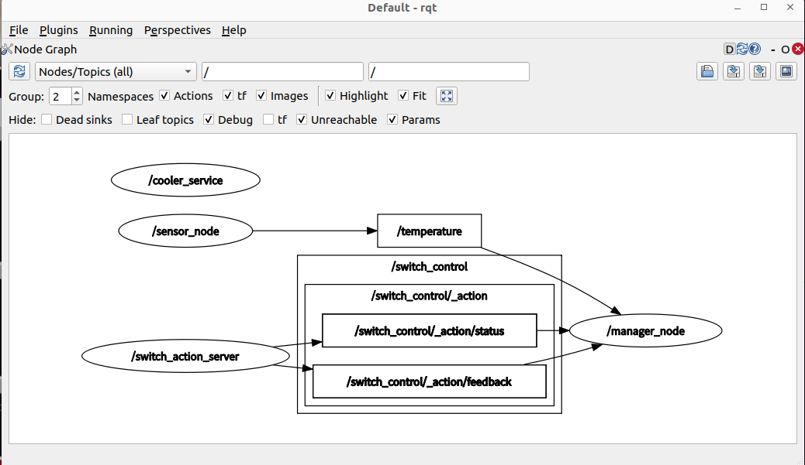
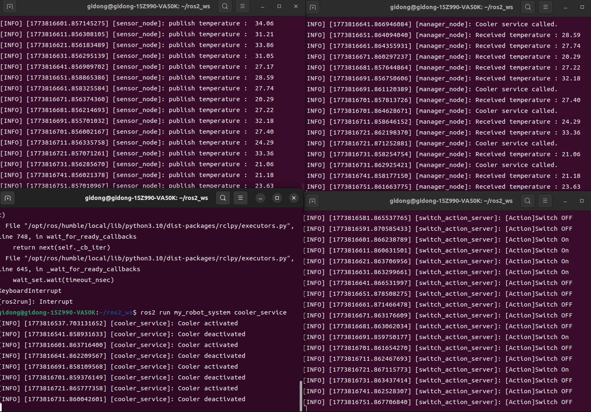

# Sensor and Cooler Activation
using differnt message types, I would like to design the system that activates cooler system when temperature of system would over certain value(30 here)

# Define interface
topic : temperature value(random 20-35)  
service : on/off control(Setbool)     
action : control cooler(feedback-status)   

# Consequence

