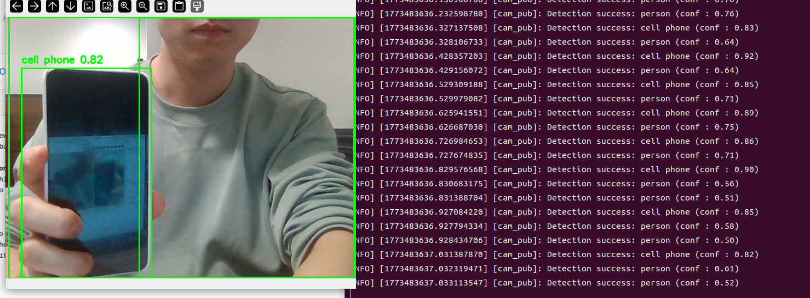
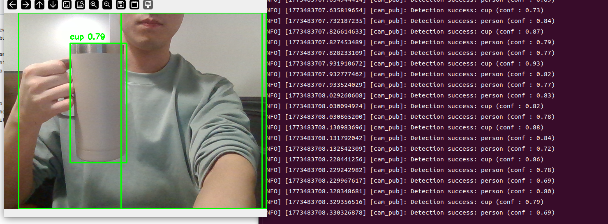
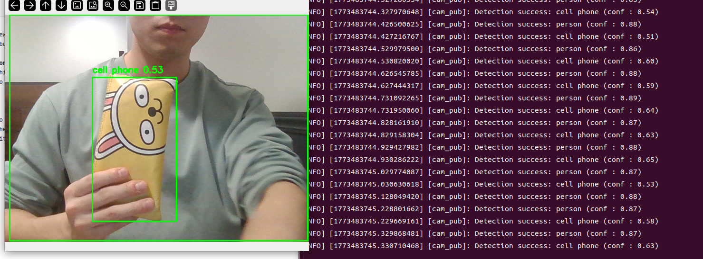

# YOLO
- yolo is a oneway detection, which allow to detect classification and localization in the same time at expense of accuracy a little bit, while RCNN do seperate them but accuracy is higher than yolo. saftest version is 5(anchor), but v8 is still used a lot(anchor free).

# How can we connect it to ROS2
- there is nothing special to use Yolo in ROS2, we can just create node and put it in it.
- and also Yolo is already pre-defined model, we don't necessarily train them. the only thing we need to do is loading pre-trained model with version we want to use

# Accuracy
- when I try to use it only loading them without fine-tuning, it has less accuracy.
- especially they detecting well bounding box, but classification is 형편없다, because they only can detect obejct that are pre-trained
- so to adapt it to our project, we need to do fine tuning with small or large dataset

# Result

